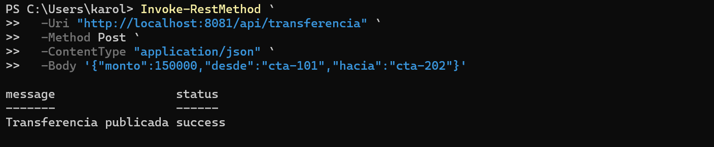

# Actividad: arquitectura orientada a eventos

Spring Boot y Redis Streams. Una transferencia publica un evento en
`banco.transferencias`; los grupos `fraude-group`, `notificaciones-group` y
`auditoria-group` lo consumen de forma independiente.

Auditoría falla algunas veces antes de enviar el `ACK`. Así se puede comprobar que Redis
mantiene el evento como pendiente.

## Ejecutar

Requisitos: Java 17, Maven y Docker.

```bash
docker run --name redis-eda -p 6379:6379 -d redis:7
mvn spring-boot:run
```

En otra terminal, crear una transferencia:

```bash
curl -X POST http://localhost:8081/api/transferencia -H "Content-Type: application/json" -d "{\"monto\":150000,\"desde\":\"cta-101\",\"hacia\":\"cta-202\"}"
```



Ver la cantidad de eventos pendientes en los logs:

```bash
curl http://localhost:8081/api/pendientes
```

