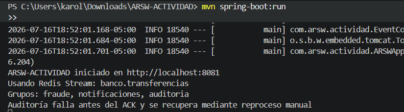
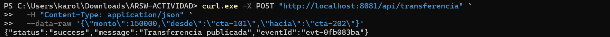
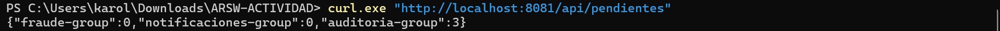
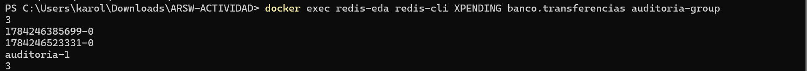
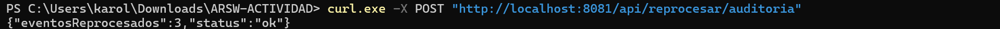
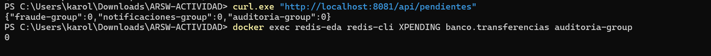
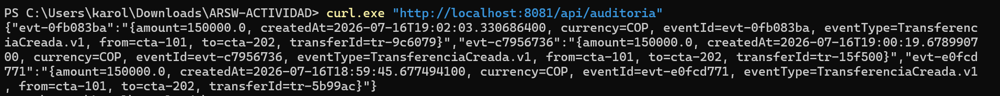
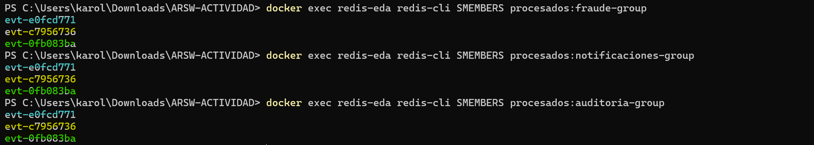

# Arquitectura Orientada A Eventos

El proyecto implementa una arquitectura orientada a eventos (EDA). El servicio de transferencias no llama directamente a fraude, notificaciones y auditoría. En su lugar publica un hecho de negocio en Redis y cada consumidor reacciona de forma independiente.

## Qué es cada elemento

### Evento

Es un hecho que ya ocurrió. Aquí se llama `TransferenciaCreada.v1`. Incluye `eventId`, `transferId`, cuentas, monto, moneda y fecha.

### Productor

`EventPublisher` es el que construye el evento y ejecuta el equivalente a `XADD`. No conoce qué servicios lo consumirán.

### Broker y stream

Redis es el broker. `banco.transferencias` es el stream persistente y ordenado donde quedan los eventos. A diferencia de Pub/Sub, un evento no desaparece porque un consumidor esté desconectado.

### Grupos de consumidores

Hay tres grupos independientes: `fraude-group`, `notificaciones-group` y `auditoria-group`.
Cada grupo recibe su propia copia lógica de todos los eventos y mantiene sus propios ACK.

### ACK y pendientes

`XACK` confirma que un grupo procesó un evento. Si el consumidor lo lee pero falla antes del ACK, Redis lo mantiene en la Pending Entries List (PEL). `XPENDING` permite observarla.


### Idempotencia

Cada grupo registra los `eventId` procesados en `procesados:<nombre-del-grupo>`. Si recibe otra vez el mismo evento, reconoce el duplicado y evita repetir su efecto de negocio.

## Levantar Redis y la aplicación

Crear el contenedor:

```powershell
docker run --name redis-eda -p 6379:6379 -d redis:7
```

Correr el contenedor:

```powershell
docker start redis-eda
```

Iniciamos el Spring Boot:

```powershell
mvn spring-boot:run
```

Aplicación inició en el puerto `8081` y que se crearon los tres grupos.



## Publicar una transferencia

Ejecutamos esto con el programa prendido:

```powershell
curl.exe -X POST "http://localhost:8081/api/transferencia" `
  -H "Content-Type: application/json" `
  --data-raw '{\"monto\":150000,\"desde\":\"cta-101\",\"hacia\":\"cta-202\"}'
```



## Probar que el evento quedó pendiente

Consulta mediante la API:

```powershell
curl.exe "http://localhost:8081/api/pendientes"
```

Debe mostrar cero para fraude y notificaciones:



Verificamos en Redis:

```powershell
docker exec redis-eda redis-cli XPENDING banco.transferencias auditoria-group
```



## Reprocesar y confirmar el ACK

Ejecute el reproceso manual:

```powershell
curl.exe -X POST "http://localhost:8081/api/reprocesar/auditoria"
```



```powershell
curl.exe "http://localhost:8081/api/pendientes"
docker exec redis-eda redis-cli XPENDING banco.transferencias auditoria-group
```



Ahora auditoria tiene cero pendientes. Los logs muestran que el evento fue guardado y que
se confirmó el ACK.

## Probar que auditoría quedó guardada

Por la API:

```powershell
curl.exe "http://localhost:8081/api/auditoria"
```



## Evidenciar la idempotencia

Vea los identificadores que cada grupo ya se proceso:

```powershell
docker exec redis-eda redis-cli SMEMBERS procesados:fraude-group
docker exec redis-eda redis-cli SMEMBERS procesados:notificaciones-group
docker exec redis-eda redis-cli SMEMBERS procesados:auditoria-group
```

El mismo `eventId` aparece una sola vez en cada conjunto. Redis Sets no admiten duplicados;
además, el consumidor consulta ese conjunto antes de ejecutar el efecto de negocio.



> La API queda en `http://localhost:8081`. 

